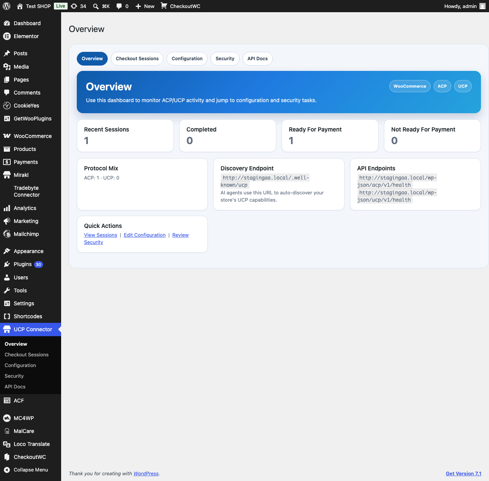
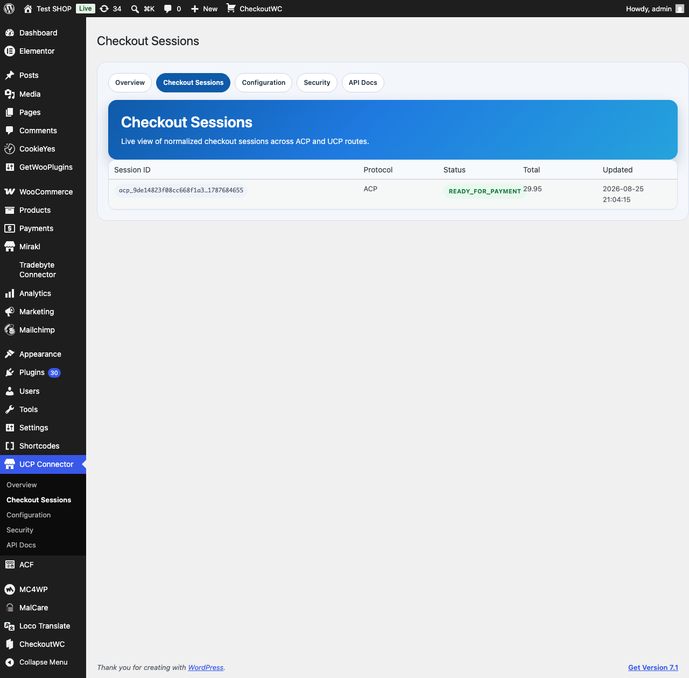
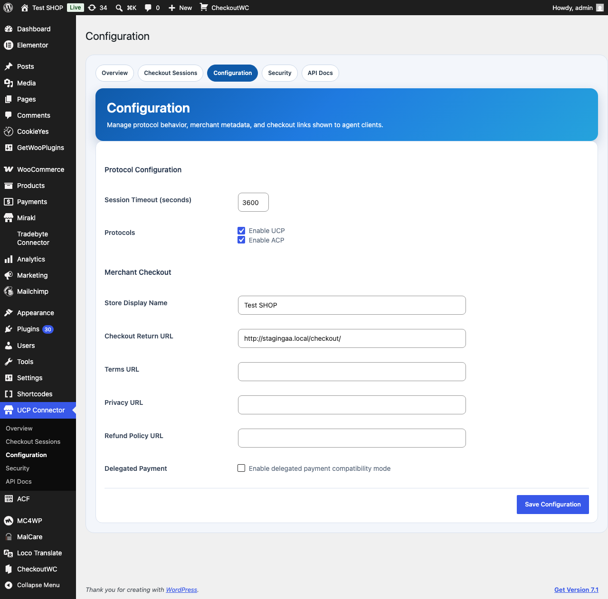
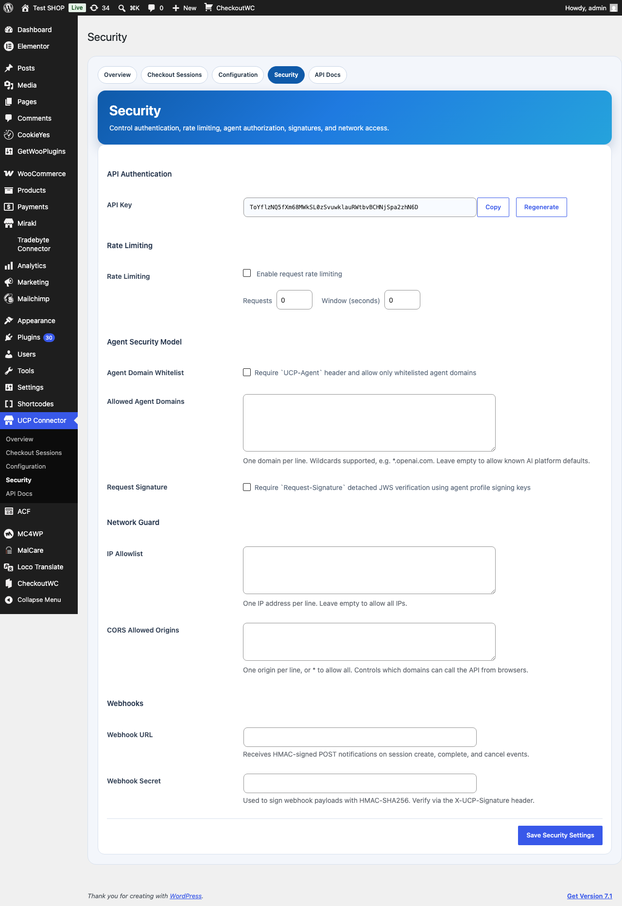
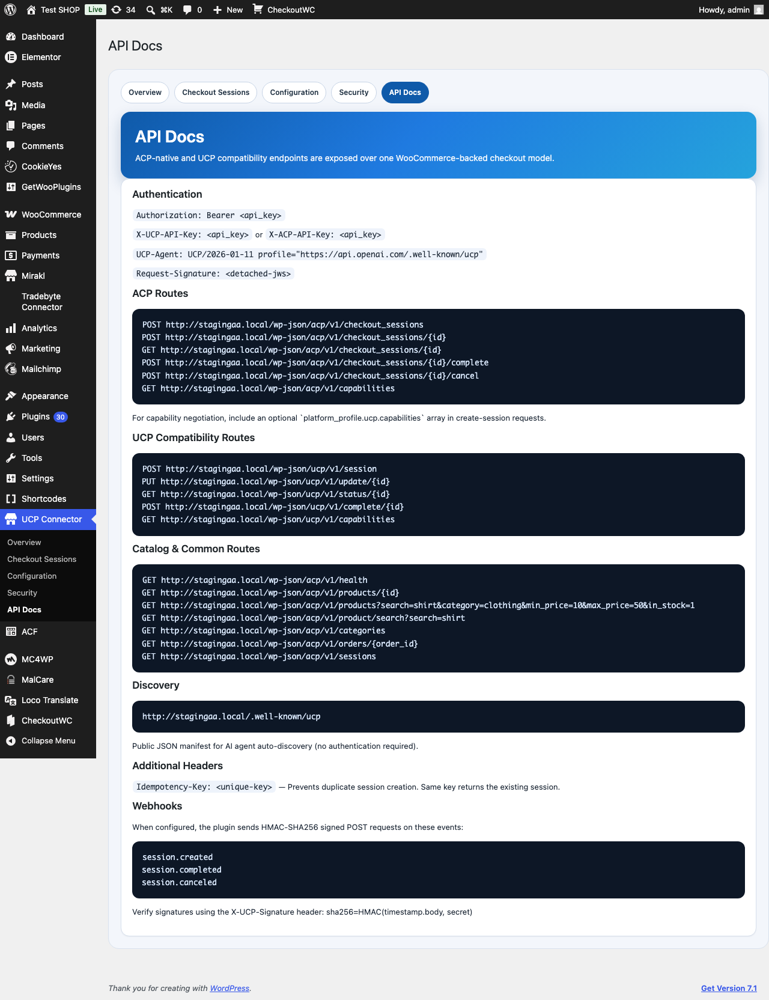

# UCP Connector for WooCommerce

[](https://github.com/SilentJMA/ucp-connector-for-woocommerce/actions/workflows/ci.yml)
[](https://github.com/SilentJMA/ucp-connector-for-woocommerce/actions/workflows/wp-integration.yml)
[](https://github.com/SilentJMA/ucp-connector-for-woocommerce/actions/workflows/security.yml)


A merchant-owned checkout adapter that bridges [UCP](https://ucp.dev) (Universal Commerce Protocol) and [ACP](https://github.com/openai/acp) (OpenAI Agentic Commerce Protocol) to WooCommerce. One normalized checkout-session model powers both protocol families, with merchant-authoritative recalculation of pricing, tax, stock, and fulfillment.

## How It Works

```
AI Agent (OpenAI, Anthropic, Google, ...)
    │
    ├─── ACP: POST /wp-json/acp/v1/checkout_sessions
    │    or
    └─── UCP: POST /wp-json/ucp/v1/session
              │
              ▼
    ┌─────────────────────────────┐
    │  UCP Connector for WooCommerce  │
    │                                 │
    │  ┌───────────────────────┐     │
    │  │  Security Layer       │     │
    │  │  API Key · IP Allow   │     │
    │  │  Agent Whitelist · JWS│     │
    │  └───────────┬───────────┘     │
    │              ▼                  │
    │  ┌───────────────────────┐     │
    │  │  Normalized Session   │     │
    │  │  Model                │     │
    │  │  buyer · items · totals│    │
    │  │  fulfillment · status │     │
    │  └───────────┬───────────┘     │
    │              ▼                  │
    │  ┌───────────────────────┐     │
    │  │  WooCommerce Engine   │     │
    │  │  Products · Tax · Ship│     │
    │  │  Orders · Coupons     │     │
    │  └───────────────────────┘     │
    └─────────────────────────────┘
              │
              ▼
    WooCommerce Order Created
```

**Session lifecycle:** `not_ready_for_payment` → `ready_for_payment` → `completed` (or `canceled`)

A session becomes ready when it has valid line items, a buyer email, and a fulfillment option. The plugin recalculates totals from WooCommerce on every update.

## Features

- **`/.well-known/ucp` discovery** — AI agents auto-discover your store's capabilities, endpoints, and auth requirements
- **Dual protocol support** — ACP and UCP endpoints on one shared session model
- **Product catalog API** — single product detail (with variations), category browsing, and enhanced search with category/price/stock filters
- **Merchant-authoritative pricing** — prices, tax, stock quantities, and coupons validated against WooCommerce on every request
- **Stock quantity validation** — prevents over-selling by capping quantities to available stock
- **Coupon/discount support** — validates and applies WooCommerce coupons (percent, fixed_cart, fixed_product)
- **Idempotency key support** — `Idempotency-Key` header prevents duplicate session creation
- **HMAC-SHA256 signed webhooks** — real-time notifications on session.created, session.completed, session.canceled
- **Agent identity tracking** — `UCP-Agent` header parsed and stored in session metadata
- **Capability negotiation** — platform profile-based capability intersection
- **Layered security** — API key auth, IP allowlist, rate limiting, agent domain whitelist, detached JWS signature verification
- **CORS support** — configurable allowed origins for cross-origin agent requests
- **Health check endpoint** — unauthenticated `GET /health` for monitoring
- **WooCommerce order creation** — sessions convert to real WooCommerce orders on completion
- **Admin dashboard** — Overview with discovery status, sessions browser, configuration, security, and API docs pages

## Screenshots

### Overview Dashboard
Session stats, protocol mix, discovery endpoint URL, and quick actions at a glance.



### Checkout Sessions
Live view of normalized checkout sessions across ACP and UCP routes with status, totals, and timestamps.



### Configuration
Protocol toggles (UCP/ACP), session timeout, merchant metadata, checkout return URL, and policy links.



### Security
API key management, rate limiting, agent domain whitelist, JWS signature verification, IP allowlist, CORS origins, and webhook signing.



### API Docs
Built-in reference for all endpoints, authentication methods, webhook events, and idempotency headers.



## Requirements

| Requirement | Version |
| ----------- | ------- |
| WordPress   | 6.9+    |
| WooCommerce | Latest  |
| PHP         | 8.0+    |

## Installation

1. Download the [latest release](https://github.com/SilentJMA/ucp-connector-for-woocommerce/releases) or clone:
   ```bash
   git clone https://github.com/SilentJMA/ucp-connector-for-woocommerce.git \
     wp-content/plugins/ucp-adapter-for-woocommerce
   ```
2. Activate the plugin in WordPress admin.
3. Navigate to **UCP Connector** in the admin sidebar.
4. Copy your API key from the **Security** page.
5. Configure protocols, merchant metadata, and security settings.

## API Endpoints

### ACP (`/wp-json/acp/v1`)

| Method | Endpoint | Description |
| ------ | -------- | ----------- |
| `POST` | `/checkout_sessions` | Create a checkout session |
| `POST` | `/checkout_sessions/{id}` | Update a session |
| `GET`  | `/checkout_sessions/{id}` | Get session status |
| `POST` | `/checkout_sessions/{id}/complete` | Complete checkout |
| `POST` | `/checkout_sessions/{id}/cancel` | Cancel session |
| `GET`  | `/capabilities` | List supported capabilities |

### UCP (`/wp-json/ucp/v1`)

| Method | Endpoint | Description |
| ------ | -------- | ----------- |
| `POST` | `/session` | Create a session (legacy) |
| `PUT`  | `/update/{id}` | Update a session (legacy) |
| `GET`  | `/status/{id}` | Get session status (legacy) |
| `POST` | `/complete/{id}` | Complete checkout (legacy) |
| `GET`  | `/capabilities` | List supported capabilities |

### Catalog & Common (both namespaces)

| Method | Endpoint | Description |
| ------ | -------- | ----------- |
| `GET`  | `/health` | Health check (no auth required) |
| `GET`  | `/products/{id}` | Single product detail with variations |
| `GET`  | `/products` | Search products with filters |
| `GET`  | `/product/search` | Search products (legacy alias) |
| `GET`  | `/categories` | List product categories |
| `GET`  | `/orders/{order_id}` | Look up a WooCommerce order |
| `GET`  | `/sessions` | List checkout sessions |

### Discovery (no authentication)

| Method | URL | Description |
| ------ | --- | ----------- |
| `GET`  | `/.well-known/ucp` | UCP discovery manifest |

### Product Search Parameters

| Parameter | Type | Description |
| --------- | ---- | ----------- |
| `search` | string | Keyword search |
| `category` | string | Category slug filter |
| `min_price` | number | Minimum price filter |
| `max_price` | number | Maximum price filter |
| `in_stock` | boolean | Stock availability filter |
| `orderby` | string | Sort: date, price, title, popularity, rating |
| `order` | string | ASC or DESC |
| `page` | int | Page number |
| `limit` | int | Results per page (max 100) |

## Authentication

All endpoints (except `/health` and `/.well-known/ucp`) require an API key via one of:

```
Authorization: Bearer <api_key>
X-UCP-API-Key: <api_key>
X-ACP-API-Key: <api_key>
```

## Security Model

The plugin provides layered security controls. See [SECURITY.md](SECURITY.md) for the full policy.

| Layer | Description | Default |
| ----- | ----------- | ------- |
| API Key | Required on all requests | Enabled |
| IP Allowlist | Restrict by client IP | Disabled |
| Rate Limiting | Per-IP + identity throttling | Disabled |
| Agent Domain Whitelist | `UCP-Agent` header domain check | Disabled |
| Request Signature | Detached JWS (ES256) verification | Disabled |

When the agent domain whitelist is enabled without custom domains, [known AI platforms](https://github.com/SilentJMA/ucp-connector-for-woocommerce#known-ai-platforms) are allowed by default (OpenAI, Google, Anthropic, Cohere, Mistral, Amazon Bedrock, Together AI, Perplexity).

## Project Structure

```
ucp-connector-for-woocommerce/
├── ucp_adapter_main.php          # Plugin entry point, CORS support
├── includes/
│   ├── api/
│   │   └── class-ucp-rest-api.php      # REST routes: checkout, catalog, health
│   ├── core/
│   │   ├── class-ucp-session-handler.php  # Session CRUD, recalculation, coupons
│   │   ├── class-ucp-security.php         # Auth, rate limiting, JWS signatures
│   │   ├── class-ucp-discovery.php        # /.well-known/ucp manifest
│   │   └── class-ucp-webhook.php          # HMAC-signed webhook dispatcher
│   └── admin/
│       └── class-ucp-admin.php            # WordPress admin UI
├── assets/
│   ├── css/                      # Admin and frontend styles
│   └── js/                       # Admin and frontend scripts
├── fixtures/                     # ACP and UCP test payloads
├── scripts/
│   └── smoke-test.sh             # End-to-end smoke test runner
└── .github/
    └── workflows/                # CI, security, release, integration tests
```

## Testing

Run the smoke test suite against a live WordPress instance:

```bash
BASE_URL="https://your-site.test" \
API_KEY="your_api_key" \
PRODUCT_ID=123 \
bash scripts/smoke-test.sh
```

This validates the full ACP and UCP flows: session creation, update, status check, completion, and order lookup with address assertions.

See [`TEST_RESULTS.md`](TEST_RESULTS.md) for the latest validation summary.

## Contributing

See [CONTRIBUTING.md](CONTRIBUTING.md) for guidelines on reporting bugs, requesting features, and submitting pull requests.

## License

[UCP Connector Non-Commercial License v1.0](LICENSE) — free for non-commercial use.
